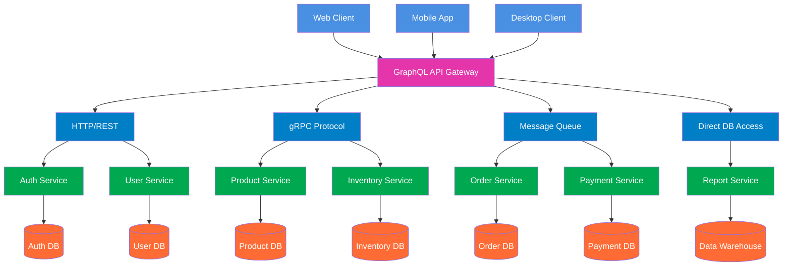

# 1. Jelaskan teorema CAP dan BASE dan keterkaitan keduanya. Jelaskan menggunakan contoh yang pernah anda gunakan. 

Teorema CAP menyatakan bahwa dalam sistem terdistribusi, hanya dua dari tiga properti ini yang bisa dipenuhi sekaligus:

* Consistency - Semua node menampilkan data yang sama
* Availability - Setiap request selalu mendapat respons
* Partition Tolerance - Sistem tetap berjalan meski ada gangguan jaringan

Dalam praktiknya, Partition Tolerance hampir selalu wajib, sehingga pilihan nyata adalah:

* CP - Konsistensi diutamakan, tapi mungkin tidak available saat gangguan
* AP - Ketersediaan diutamakan, tapi data mungkin tidak konsisten sementara

BASE adalah filosofi untuk sistem yang memilih AP:

* Basically Available - Sistem tetap merespons meski dengan keterbatasan
* Soft State - Data bisa berubah tanpa input baru
* Eventually Consistent - Data akan konsisten setelah beberapa waktu

Hubungannya:

* CAP = Kerangka teori yang menjelaskan trade-off
* BASE = Implementasi praktis untuk sistem yang memilih AP

Contoh Penerapan:

Manajemen Stok (CP): Layanan ini bertanggung jawab atas jumlah stok produk. Ketika partisi terdeteksi, layanan akan menolak permintaan "kurangi stok" atau "tambah stok" (menjadi tidak tersedia atau tidak merespons dengan cepat) daripada mengambil risiko konsistensi data. Kami tidak ingin dua pelanggan membeli produk yang sama dan keduanya berhasil karena data stok tidak konsisten. Setelah jaringan pulih, operasi dilanjutkan dan konsistensi terjaga.

Keranjang Belanja (AP): Layanan ini menangani keranjang belanja pengguna. Jika terjadi partisi, layanan tetap tersedia dan membiarkan pengguna menambah atau menghapus item dari keranjang mereka. Data keranjang sementara disimpan secara lokal di node yang terpisah. Akibatnya, untuk sementara waktu, jika pengguna mengakses dari perangkat yang berbeda (yang mungkin terhubung ke node yang berbeda), mereka mungkin melihat keranjang yang sedikit tidak sinkron. Namun, setelah partisi jaringan teratasi, sistem akan menyinkronkan semua perubahan.

# 2. Jelaskan keterkaitan antara GraphQL dengan komunikasi antar proses pada sistem terdistribusi. Buat diagramnya. 

GraphQL berfungsi sebagai lapisan abstraksi yang menyederhanakan komunikasi antar proses (IPC) dalam sistem terdistribusi. Daripada client harus berkomunikasi langsung dengan berbagai microservices menggunakan berbagai protokol IPC, GraphQL menyediakan satu endpoint terpadu yang menerjemahkan query client menjadi serangkaian pemanggilan IPC terkoordinasi ke berbagai service backend.

GraphQL resolver bertindak sebagai orchestrator yang mengelola kompleksitas IPC - menentukan service mana yang perlu dipanggil, menggunakan protokol apa (REST, gRPC, dll), dan mengaggregasi hasilnya. Client cukup mengirimkan query tunggal yang mendefinisikan kebutuhan data, sementara GraphQL yang menangani multiple IPC calls ke berbagai services.

Keuntungan utamanya adalah efisiensi dan simplikasi. Client terhindar dari over-fetching dan under-fetching data, serta tidak perlu memahami kompleksitas arsitektur microservices di backend. Di sisi lain, tim backend dapat mengembangkan services secara independen selama GraphQL schema tetap konsisten, menciptakan sistem terdistribusi yang lebih maintainable dan scalable.

## Diagram Arsitektur GraphQL sebagai API Gateway


# 3. Dengan menggunakan Docker / Docker Compose, buatlah streaming replication di PostgreSQL yang bisa menjelaskan sinkronisasi. Tulislah langkah-langkah pengerjaannya dan buat penjelasan secukupnya.


Membuat folder terpisah untuk menyimpan file docker dan data PostgreSQL:

```
mkdir postgres_replication
```

Ubah direktori kerja:

```
cd postgres_replication
```

Tambahkan beberapa direktori untuk me-mount volume Master dan Standby:

```
mkdir -p ./data-master ./tmp-master ./data-standby ./tmp-standby
```

Buat file docker compose, yang akan digunakan untuk men-setup Master dan Standby Node:

```
touch docker-compose.yml
```

---

## Mengatur Master Node

Perbarui file docker-compose.yml yang dibuat tadi dengan nilai berikut:

```
version: '1'

services:
  pgtest_master:
    image: postgres:latest
    container_name: pgtest_master
    restart: always
    volumes:
        - ./data-master:/var/lib/postgresql/data
        - ./tmp-master:/tmp
    ports:
      - '5454:5432'
    environment:
      - 'POSTGRES_USER=postgres'
      - 'POSTGRES_PASSWORD=pass@123'
      - 'POSTGRES_DB=postgres'
```

Penjelasan :

* `image postgres:latest` untuk menginstal PostgreSQL versi terbaru di Docker
* `pgtest_master` sebagai nama container, ditentukan dengan parameter `container_name`
* `restart: always` agar container selalu restart saat boot
* `volumes` melakukan mount direktori host ke container; direktori data PostgreSQL di container dipetakan ke `data-master`
* `ports` memetakan port Docker ke host; port 5432 di container dipetakan ke 5454 di host
* `environment` menetapkan variabel environment default (database, user, password)

Jalankan docker file untuk menjalankan master node:

```
sudo docker compose up -d
```

---

## Konfigurasi Awal

Periksa apakah container berjalan:

```
sudo docker ps
```

Verifikasi parameter `listen_addresses` (harus * untuk semua):

```
sudo docker exec pgtest_master psql -U postgres -c "SHOW listen_addresses;"
```

Periksa port default 5432:

```
sudo docker exec pgtest_master psql -U postgres -c "SHOW port;"
```

Verifikasi `wal_level` disetel ke `replica`:

```
sudo docker exec pgtest_master psql -U postgres -c "SHOW wal_level;"
```

Parameter lain yang penting: `hot_standby`, `max_wal_senders`, `max_replication_slots`. Namun nilai default biasanya cukup untuk WAL streaming.

Mulai sesi shell di master:

```
sudo docker exec -it pgtest_master bash
```

Karena perlu menjaga koneksi antar node, kita harus memperbarui file host-based access (hba).

Tambahkan entri ke `pg_hba.conf` agar user replikasi dapat terhubung secara remote:

```
echo 'host replication replicator 0.0.0.0/0 scram-sha-256' >> /var/lib/postgresql/data/pg_hba.conf
```

Keluar dari shell:

```
exit
```

Selanjutnya, buat user replikasi.

Mulai sesi psql dari host:

```
psql -h 127.0.0.1 -U postgres -p 5454 postgres
```

(Password yang digunakan adalah POSTGRES_PASSWORD dari docker-compose.yml.)

Buat user replikasi:

```
CREATE USER replicator WITH REPLICATION ENCRYPTED PASSWORD 'replicator';
```

Buat Physical Replication Slot:

```
SELECT * FROM pg_create_physical_replication_slot('replication_slot_standby1');
```

Verifikasi slot:

```
SELECT * FROM pg_replication_slots;
```

Keluar psql:

```
\q
```

---

## Melakukan Backup

Masuk ke shell master lagi:

```
sudo docker exec -it pgtest_master bash
```

Lakukan backup:

```
pg_basebackup -D /tmp -S replication_slot_standby1 -X stream -P -U replicator -Fp -R
```

Penjelasan parameter:

* `-D` lokasi backup data directory (menggunakan `/tmp` yang di-mount)
* `-S` nama physical replication slot
* `-X stream` menyertakan WAL dalam backup
* `-P` menampilkan progress
* `-U` user replikasi
* `-Fp` menggunakan format plain
* `-R` membuat file recovery dan pengaturan standby

Keluar:

```
exit
```

---

## Konfigurasi Akhir

Verifikasi apakah data directory telah dibuat:

```
sudo ls -lh tmp-master/
```

Pindahkan data dari tmp-master ke data-standby:

```
sudo mv tmp-master/* data-standby/
```

Periksa file konfigurasi standby:

```
sudo nano data-standby/postgresql.auto.conf
```

Pastikan memiliki nilai berikut:

```
primary_conninfo = 'host=pgtest_master port=5432 user=replicator password=replicator'
primary_slot_name = 'replication_slot_standby1'
restore_command = 'cp /var/lib/postgresql/data/pg_wal/%f "%p"'
```

Hentikan master:

```
sudo docker compose down
```

---

## Mengatur Standby Node

Tambahkan konfigurasi standby ke docker-compose.yml:

```
version: '1'

services:
...
  pgtest_standby:
    image: postgres:latest
    container_name: pgtest_standby
    restart: always
    volumes:
        - ./data-standby:/var/lib/postgresql/data
        - ./tmp-standby:/tmp
    ports:
      - '5455:5432'
    environment:
      - 'POSTGRES_USER=postgres'
      - 'POSTGRES_PASSWORD=pass@123'
      - 'POSTGRES_DB=postgres'
```

Perbedaan utama:

* `pgtest_standby` sebagai nama container
* volume menggunakan `data-standby`
* port host yang digunakan 5455

File docker-compose.yml akhir:

Jalankan:

```
sudo docker compose up -d
```

---

## Verifikasi Replikasi

Periksa kedua container:

```
sudo docker ps
```

Mulai psql di master:

```
psql -h 127.0.0.1 -U postgres -p 5454 postgres
```

Periksa streaming:

```
SELECT * FROM pg_stat_replication;
```

Tambahkan data:

```
CREATE TABLE employee (id int, "name" varchar(50));
INSERT INTO employee VALUES (1, 'Swastik');
```

Mulai psql di standby:

```
psql -h 127.0.0.1 -U postgres -p 5455 postgres
```

Periksa wal receiver:

```
SELECT * FROM pg_stat_wal_receiver;
```

Periksa apakah data tersinkron:

```
SELECT * FROM employee;
```

---

## Mengaktifkan Synchronous Replication

Masuk shell master:

```
sudo docker exec -it pgtest_master bash
```

Periksa nilai:

```
cat /var/lib/postgresql/data/postgresql.conf | grep synchronous_standby_names
```

Jika belum disetel, ubah:

```
sed -i "s/#synchronous_standby_names = ''/synchronous_standby_names = '*'/g" /var/lib/postgresql/data/postgresql.conf
```

Verifikasi:

```
cat /var/lib/postgresql/data/postgresql.conf | grep synchronous_standby_names
```

Keluar:

```
exit
```

Restart server:

```
sudo docker compose down && sudo docker compose up -d
```

Periksa status sinkronisasi:

```
psql -h 127.0.0.1 -U postgres -p 5454 postgres
SELECT sync_state FROM pg_stat_replication;
```

Jika hasilnya `sync`, synchronous replication berhasil.
