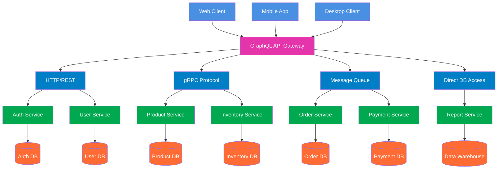

# 1. Jelaskan teorema CAP dan BASE dan keterkaitan keduanya. Jelaskan menggunakan contoh yang pernah anda gunakan. 

Teorema CAP menyatakan bahwa dalam sistem terdistribusi, hanya dua dari tiga properti ini yang bisa dipenuhi sekaligus:

* Consistency - Semua node menampilkan data yang sama
* Availability - Setiap request selalu mendapat respons
* Partition Tolerance - Sistem tetap berjalan meski ada gangguan jaringan

Dalam praktiknya, Partition Tolerance hampir selalu wajib, sehingga pilihan nyata adalah:

* CP - Konsistensi diutamakan, tapi mungkin tidak available saat gangguan
* AP - Ketersediaan diutamakan, tapi data mungkin tidak konsisten sementara

BASE adalah filosofi untuk sistem yang memilih AP:

* Basically Available - Sistem tetap merespons meski dengan keterbatasan
* Soft State - Data bisa berubah tanpa input baru
* Eventually Consistent - Data akan konsisten setelah beberapa waktu

Hubungannya:

* CAP = Kerangka teori yang menjelaskan trade-off
* BASE = Implementasi praktis untuk sistem yang memilih AP

Contoh Penerapan:

Manajemen Stok (CP): Layanan ini bertanggung jawab atas jumlah stok produk. Ketika partisi terdeteksi, layanan akan menolak permintaan "kurangi stok" atau "tambah stok" (menjadi tidak tersedia atau tidak merespons dengan cepat) daripada mengambil risiko konsistensi data. Kami tidak ingin dua pelanggan membeli produk yang sama dan keduanya berhasil karena data stok tidak konsisten. Setelah jaringan pulih, operasi dilanjutkan dan konsistensi terjaga.

Keranjang Belanja (AP): Layanan ini menangani keranjang belanja pengguna. Jika terjadi partisi, layanan tetap tersedia dan membiarkan pengguna menambah atau menghapus item dari keranjang mereka. Data keranjang sementara disimpan secara lokal di node yang terpisah. Akibatnya, untuk sementara waktu, jika pengguna mengakses dari perangkat yang berbeda (yang mungkin terhubung ke node yang berbeda), mereka mungkin melihat keranjang yang sedikit tidak sinkron. Namun, setelah partisi jaringan teratasi, sistem akan menyinkronkan semua perubahan.

# 2. Jelaskan keterkaitan antara GraphQL dengan komunikasi antar proses pada sistem terdistribusi. Buat diagramnya. 

GraphQL berfungsi sebagai lapisan abstraksi yang menyederhanakan komunikasi antar proses (IPC) dalam sistem terdistribusi. Daripada client harus berkomunikasi langsung dengan berbagai microservices menggunakan berbagai protokol IPC, GraphQL menyediakan satu endpoint terpadu yang menerjemahkan query client menjadi serangkaian pemanggilan IPC terkoordinasi ke berbagai service backend.

GraphQL resolver bertindak sebagai orchestrator yang mengelola kompleksitas IPC - menentukan service mana yang perlu dipanggil, menggunakan protokol apa (REST, gRPC, dll), dan mengaggregasi hasilnya. Client cukup mengirimkan query tunggal yang mendefinisikan kebutuhan data, sementara GraphQL yang menangani multiple IPC calls ke berbagai services.

Keuntungan utamanya adalah efisiensi dan simplikasi. Client terhindar dari over-fetching dan under-fetching data, serta tidak perlu memahami kompleksitas arsitektur microservices di backend. Di sisi lain, tim backend dapat mengembangkan services secara independen selama GraphQL schema tetap konsisten, menciptakan sistem terdistribusi yang lebih maintainable dan scalable.

## Diagram Arsitektur GraphQL sebagai API Gateway


# 3. Dengan menggunakan Docker / Docker Compose, buatlah streaming replication di PostgreSQL yang bisa menjelaskan sinkronisasi. Tulislah langkah-langkah pengerjaannya dan buat penjelasan secukupnya.

Baik — berikut **terjemahan lengkap ke Bahasa Indonesia**, **tanpa mengubah bagian kode sama sekali**.
Semua kode, perintah, dan konfigurasi dibiarkan **apa adanya**.

---

# Terjemahan

**Langkah Pertama**
Mulailah dengan membuat folder terpisah untuk menyimpan docker file dan data PostgreSQL:

```
mkdir postgres_replication
```

Ubah direktori kerja:

```
cd postgres_replication
```

Tambahkan beberapa direktori untuk me-mount volume Master dan Standby:

```
mkdir -p ./data-master ./tmp-master ./data-standby ./tmp-standby
```

Buat file docker compose yang akan digunakan untuk menyiapkan Master dan Standby Node:

```
touch docker-compose.yml
```

---

# **Menyiapkan Master Node**

Perbarui file `docker-compose.yml` yang sudah dibuat sebelumnya dengan nilai berikut:

```
version: '1'

services:
  pgtest_master:
    image: postgres:latest
    container_name: pgtest_master
    restart: always
    volumes:
        - ./data-master:/var/lib/postgresql/data
        - ./tmp-master:/tmp
    ports:
      - '5454:5432'
    environment:
      - 'POSTGRES_USER=postgres'
      - 'POSTGRES_PASSWORD=pass@123'
      - 'POSTGRES_DB=postgres'
```

**Penjelasan nilai yang digunakan:**

* `image postgres:latest` untuk menginstal PostgreSQL versi terbaru di Docker
* `pgtest_master` sebagai nama container
* `restart: always` untuk menjalankan container setiap boot
* `volumes` memetakan direktori host ke direktori dalam container
* `ports` memetakan port container 5432 ke port host 5454
* `environment` mengatur user, password, dan database default

Jalankan docker file untuk memulai master node:

```
sudo docker compose up -d
```

---

# **Konfigurasi Awal**

Periksa apakah container sudah berjalan:

```
sudo docker ps
```

Verifikasi parameter `listen_addresses` (harus bernilai `*`):

```
sudo docker exec pgtest_master psql -U postgres -c "SHOW listen_addresses;"
```

Periksa port default 5432:

```
sudo docker exec pgtest_master psql -U postgres -c "SHOW port;"
```

Verifikasi bahwa `wal_level` bernilai `replica`:

```
sudo docker exec pgtest_master psql -U postgres -c "SHOW wal_level;"
```

Parameter lain seperti `hot_standby`, `max_wal_senders`, dan `max_replication_slots` bisa diperiksa, tetapi nilai default sudah cukup.

Mulai sesi shell interaktif di master:

```
sudo docker exec -it pgtest_master bash
```

Kita perlu mengizinkan koneksi antara kedua node, jadi perlu memperbarui file akses berbasis host (hba).

Tambahkan entri ke dalam `pg_hba.conf`:

```
echo 'host replication replicator 0.0.0.0/0 scram-sha-256' >> /var/lib/postgresql/data/pg_hba.conf
```

Keluar dari shell:

```
exit
```

Sekarang buat user untuk replikasi:

Mulai sesi psql dari host:

```
psql -h 127.0.0.1 -U postgres -p 5454 postgres
```

Buat user replikasi:

```
CREATE USER replicator WITH REPLICATION ENCRYPTED PASSWORD 'replicator';
```

Buat physical replication slot:

```
SELECT * FROM pg_create_physical_replication_slot('replication_slot_standby1');
```

Verifikasi slot:

```
SELECT * FROM pg_replication_slots;
```

Keluar dari psql:

```
\q
```

---

# **Melakukan Base Backup**

Masuk lagi ke master:

```
sudo docker exec -it pgtest_master bash
```

Jalankan base backup:

```
pg_basebackup -D /tmp -S replication_slot_standby1 -X stream -P -U replicator -Fp -R
```

**Penjelasan parameter:**

* `-D` lokasi folder backup
* `-S` nama replication slot
* `-X stream` sertakan WAL
* `-P` tampilkan progress
* `-U` user replicator
* `-Fp` backup format plain
* `-R` membuat `standby.signal` dan `primary_conninfo` otomatis

Keluar:

```
exit
```

Periksa isi direktori backup:

```
sudo ls -lh tmp-master/
```

Pindahkan data ke folder standby:

```
sudo mv tmp-master/* data-standby/
```

Periksa file konfigurasi:

```
sudo nano data-standby/postgresql.auto.conf
```

Pastikan nilainya sesuai:

*(kode asli dipertahankan, tidak diterjemahkan)*

---

Stop master node:

```
sudo docker compose down
```

Data tetap aman di direktori host.

---

# **Menyiapkan Standby Node**

Perbarui docker-compose dengan menambahkan service standby:

```
version: '1'

services:
...
  pgtest_standby:
    image: postgres:latest
    container_name: pgtest_standby
    restart: always
    volumes:
        - ./data-standby:/var/lib/postgresql/data
        - ./tmp-standby:/tmp
    ports:
      - '5455:5432'
    environment:
      - 'POSTGRES_USER=postgres'
      - 'POSTGRES_PASSWORD=pass@123'
      - 'POSTGRES_DB=postgres'
```

Ini hampir sama seperti master, tetapi:

* nama container berbeda
* direktori data mengarah ke `data-standby`
* port host 5455

**File lengkap docker-compose.yml ditampilkan (tidak diterjemahkan karena merupakan kode).**

Jalankan semuanya:

```
sudo docker compose up -d
```

---

# **Verifikasi Replikasi**

Periksa container:

```
sudo docker ps
```

Masuk ke master:

```
psql -h 127.0.0.1 -U postgres -p 5454 postgres
```

Lihat status replikasi:

```
SELECT * FROM pg_stat_replication;
```

Tambahkan data pada master:

```
CREATE TABLE employee (id int, "name" varchar(50));
INSERT INTO employee VALUES (1, 'Swastik');
```

Masuk ke standby:

```
psql -h 127.0.0.1 -U postgres -p 5455 postgres
```

Periksa wal receiver:

```
SELECT * FROM pg_stat_wal_receiver;
```

Verifikasi data:

```
SELECT * FROM employee;
```

Jika data muncul, replikasi berhasil.

---

# **Mengaktifkan Synchronous Replication**

Masuk ke master:

```
sudo docker exec -it pgtest_master bash
```

Periksa parameter:

```
cat /var/lib/postgresql/data/postgresql.conf | grep synchronous_standby_names
```

Jika perlu, ubah nilainya:

```
sed -i "s/#synchronous_standby_names = ''/synchronous_standby_names = '*'/g" /var/lib/postgresql/data/postgresql.conf
```

Verifikasi perubahan, lalu keluar:

```
exit
```

Restart server:

```
sudo docker compose down && sudo docker compose up -d
```

Cek status sinkronisasi:

```
SELECT sync_state FROM pg_stat_replication;
```

Jika bernilai `sync` maka sinkronisasi berhasil.

---


