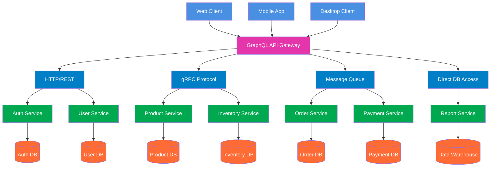

# 1. Jelaskan teorema CAP dan BASE dan keterkaitan keduanya. Jelaskan menggunakan contoh yang pernah anda gunakan. 

Teorema CAP menyatakan bahwa dalam sistem terdistribusi, hanya dua dari tiga properti ini yang bisa dipenuhi sekaligus:

* Consistency - Semua node menampilkan data yang sama
* Availability - Setiap request selalu mendapat respons
* Partition Tolerance - Sistem tetap berjalan meski ada gangguan jaringan

Dalam praktiknya, Partition Tolerance hampir selalu wajib, sehingga pilihan nyata adalah:

* CP - Konsistensi diutamakan, tapi mungkin tidak available saat gangguan
* AP - Ketersediaan diutamakan, tapi data mungkin tidak konsisten sementara

BASE adalah filosofi untuk sistem yang memilih AP:

* Basically Available - Sistem tetap merespons meski dengan keterbatasan
* Soft State - Data bisa berubah tanpa input baru
* Eventually Consistent - Data akan konsisten setelah beberapa waktu

Hubungannya:

* CAP = Kerangka teori yang menjelaskan trade-off
* BASE = Implementasi praktis untuk sistem yang memilih AP

Contoh Penerapan:

Manajemen Stok (CP): Layanan ini bertanggung jawab atas jumlah stok produk. Ketika partisi terdeteksi, layanan akan menolak permintaan "kurangi stok" atau "tambah stok" (menjadi tidak tersedia atau tidak merespons dengan cepat) daripada mengambil risiko konsistensi data. Kami tidak ingin dua pelanggan membeli produk yang sama dan keduanya berhasil karena data stok tidak konsisten. Setelah jaringan pulih, operasi dilanjutkan dan konsistensi terjaga.

Keranjang Belanja (AP): Layanan ini menangani keranjang belanja pengguna. Jika terjadi partisi, layanan tetap tersedia dan membiarkan pengguna menambah atau menghapus item dari keranjang mereka. Data keranjang sementara disimpan secara lokal di node yang terpisah. Akibatnya, untuk sementara waktu, jika pengguna mengakses dari perangkat yang berbeda (yang mungkin terhubung ke node yang berbeda), mereka mungkin melihat keranjang yang sedikit tidak sinkron. Namun, setelah partisi jaringan teratasi, sistem akan menyinkronkan semua perubahan.

# 2. Jelaskan keterkaitan antara GraphQL dengan komunikasi antar proses pada sistem terdistribusi. Buat diagramnya. 

GraphQL berfungsi sebagai lapisan abstraksi yang menyederhanakan komunikasi antar proses (IPC) dalam sistem terdistribusi. Daripada client harus berkomunikasi langsung dengan berbagai microservices menggunakan berbagai protokol IPC, GraphQL menyediakan satu endpoint terpadu yang menerjemahkan query client menjadi serangkaian pemanggilan IPC terkoordinasi ke berbagai service backend.

GraphQL resolver bertindak sebagai orchestrator yang mengelola kompleksitas IPC - menentukan service mana yang perlu dipanggil, menggunakan protokol apa (REST, gRPC, dll), dan mengaggregasi hasilnya. Client cukup mengirimkan query tunggal yang mendefinisikan kebutuhan data, sementara GraphQL yang menangani multiple IPC calls ke berbagai services.

Keuntungan utamanya adalah efisiensi dan simplikasi. Client terhindar dari over-fetching dan under-fetching data, serta tidak perlu memahami kompleksitas arsitektur microservices di backend. Di sisi lain, tim backend dapat mengembangkan services secara independen selama GraphQL schema tetap konsisten, menciptakan sistem terdistribusi yang lebih maintainable dan scalable.

## Diagram Arsitektur GraphQL sebagai API Gateway

# 3. Dengan menggunakan Docker / Docker Compose, buatlah streaming replication di PostgreSQL yang bisa menjelaskan sinkronisasi. Tulislah langkah-langkah pengerjaannya dan buat penjelasan secukupnya.

1. Siapkan direktori
Buat folder utama untuk proyek Anda, lalu buat subfolder untuk volume data master dan standby. 
bash
mkdir pg-replication
cd pg-replication
mkdir master-data standby-data
2. Buat file docker-compose.yml 
Buat file bernama docker-compose.yml di dalam folder pg-replication dengan isi sebagai berikut. 
yaml
services:
  master:
    image: postgres:latest
    container_name: pg-master
    environment:
      POSTGRES_DB: mydatabase
      POSTGRES_USER: myuser
      POSTGRES_PASSWORD: mypassword
    ports:
      - "5432:5432"
    volumes:
      - master-data:/var/lib/postgresql/data
    command: postgres -c wal_level=replica -c max_wal_senders=5 -c wal_sender_timeout=0 -c listen_addresses='*'

  standby:
    image: postgres:latest
    container_name: pg-standby
    environment:
      POSTGRES_DB: mydatabase
      POSTGRES_USER: myuser
      POSTGRES_PASSWORD: mypassword
    ports:
      - "5433:5432"
    volumes:
      - standby-data:/var/lib/postgresql/data
    depends_on:
      - master
    command: "pg_basebackup -h master -D /var/lib/postgresql/data -F p -Xs -P -R && echo 'Standby initialized'"

volumes:
  master-data:
  standby-data:
•	command di master: Mengkonfigurasi PostgreSQL untuk streaming replication dengan wal_level=replica dan max_wal_senders yang cukup.
•	command di standby: Menggunakan pg_basebackup untuk melakukan base backup dari kontainer master, lalu menyimpan datanya ke folder standby-data. Opsi -R secara otomatis membuat file standby.signal dan postgresql.auto.conf untuk konfigurasi streaming replication. 
3. Jalankan kontainer
Jalankan Docker Compose untuk membuat dan memulai kontainer. 
bash
docker-compose up -d
4. Verifikasi
•	Periksa status kontainer:
bash
docker-compose ps
•	Hubungkan ke master dan buat user replikasi, lalu buat replication slot.
bash
docker-compose exec master psql -U myuser -d mydatabase
sql
CREATE ROLE repl_user WITH REPLICATION LOGIN PASSWORD 'repl_password';
SELECT pg_create_physical_replication_slot('standby1_slot');
Keluar dari psql.
•	Hubungkan ke master lagi untuk menguji apakah data sudah tersinkronisasi.
bash
docker-compose exec master psql -U myuser -d mydatabase
sql
CREATE TABLE replication_test (id SERIAL PRIMARY KEY, message TEXT);
INSERT INTO replication_test (message) VALUES ('Testing replication');
•	Hubungkan ke standby untuk melihat data yang sudah tersinkronisasi.

docker-compose exec standby psql -U myuser -d mydatabase
sql
SELECT * FROM replication_test;
Anda akan melihat data yang sudah dimasukkan di kontainer master. 

