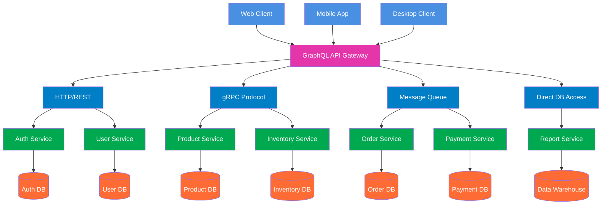

# 1. Jelaskan teorema CAP dan BASE dan keterkaitan keduanya. Jelaskan menggunakan contoh yang pernah anda gunakan. 

Teorema CAP menyatakan bahwa dalam sistem terdistribusi, hanya dua dari tiga properti ini yang bisa dipenuhi sekaligus:

* Consistency - Semua node menampilkan data yang sama
* Availability - Setiap request selalu mendapat respons
* Partition Tolerance - Sistem tetap berjalan meski ada gangguan jaringan

Dalam praktiknya, Partition Tolerance hampir selalu wajib, sehingga pilihan nyata adalah:

* CP - Konsistensi diutamakan, tapi mungkin tidak available saat gangguan
* AP - Ketersediaan diutamakan, tapi data mungkin tidak konsisten sementara

BASE adalah filosofi untuk sistem yang memilih AP:

* Basically Available - Sistem tetap merespons meski dengan keterbatasan
* Soft State - Data bisa berubah tanpa input baru
* Eventually Consistent - Data akan konsisten setelah beberapa waktu

Hubungannya:

* CAP = Kerangka teori yang menjelaskan trade-off
* BASE = Implementasi praktis untuk sistem yang memilih AP

Contoh Penerapan:

Manajemen Stok (CP): Layanan ini bertanggung jawab atas jumlah stok produk. Ketika partisi terdeteksi, layanan akan menolak permintaan "kurangi stok" atau "tambah stok" (menjadi tidak tersedia atau tidak merespons dengan cepat) daripada mengambil risiko konsistensi data. Kami tidak ingin dua pelanggan membeli produk yang sama dan keduanya berhasil karena data stok tidak konsisten. Setelah jaringan pulih, operasi dilanjutkan dan konsistensi terjaga.

Keranjang Belanja (AP): Layanan ini menangani keranjang belanja pengguna. Jika terjadi partisi, layanan tetap tersedia dan membiarkan pengguna menambah atau menghapus item dari keranjang mereka. Data keranjang sementara disimpan secara lokal di node yang terpisah. Akibatnya, untuk sementara waktu, jika pengguna mengakses dari perangkat yang berbeda (yang mungkin terhubung ke node yang berbeda), mereka mungkin melihat keranjang yang sedikit tidak sinkron. Namun, setelah partisi jaringan teratasi, sistem akan menyinkronkan semua perubahan.

# 2. Jelaskan keterkaitan antara GraphQL dengan komunikasi antar proses pada sistem terdistribusi. Buat diagramnya. 

GraphQL berfungsi sebagai lapisan abstraksi yang menyederhanakan komunikasi antar proses (IPC) dalam sistem terdistribusi. Daripada client harus berkomunikasi langsung dengan berbagai microservices menggunakan berbagai protokol IPC, GraphQL menyediakan satu endpoint terpadu yang menerjemahkan query client menjadi serangkaian pemanggilan IPC terkoordinasi ke berbagai service backend.

GraphQL resolver bertindak sebagai orchestrator yang mengelola kompleksitas IPC - menentukan service mana yang perlu dipanggil, menggunakan protokol apa (REST, gRPC, dll), dan mengaggregasi hasilnya. Client cukup mengirimkan query tunggal yang mendefinisikan kebutuhan data, sementara GraphQL yang menangani multiple IPC calls ke berbagai services.

Keuntungan utamanya adalah efisiensi dan simplikasi. Client terhindar dari over-fetching dan under-fetching data, serta tidak perlu memahami kompleksitas arsitektur microservices di backend. Di sisi lain, tim backend dapat mengembangkan services secara independen selama GraphQL schema tetap konsisten, menciptakan sistem terdistribusi yang lebih maintainable dan scalable.

## Diagram Arsitektur GraphQL sebagai API Gateway

# 3. Dengan menggunakan Docker / Docker Compose, buatlah streaming replication di PostgreSQL yang bisa menjelaskan sinkronisasi. Tulislah langkah-langkah pengerjaannya dan buat penjelasan secukupnya.

Persiapan Struktur Direktori
Buat direktori kerja dan sub-direktori yang diperlukan:
bash
mkdir postgres_replication
cd postgres_replication
mkdir -p master/data standby/data init-scripts
Use code with caution.

2. File Konfigurasi dan Skrip Inisialisasi
Kita akan menggunakan beberapa file:
docker-compose.yml: Mendefinisikan layanan master dan standby.
init-scripts/setup-replication.sh: Skrip untuk menyiapkan replikasi secara otomatis.
init-scripts/init-db.sql: Skrip SQL opsional untuk membuat tabel awal. 
A. docker-compose.yml 
Buat file docker-compose.yml di direktori utama postgres_replication:
yaml
version: '3.8'

services:
  postgres-master:
    image: postgres:16-alpine # Menggunakan versi 16-alpine
    container_name: postgres-master
    volumes:
      - ./master/data:/var/lib/postgresql/data
      - ./init-scripts:/docker-entrypoint-initdb.d
    ports:
      - "5432:5432"
    environment:
      POSTGRES_USER: admin
      POSTGRES_PASSWORD: password
      POSTGRES_DB: replication_db
      PGDATA: /var/lib/postgresql/data
    networks:
      - pg-network

  postgres-standby:
    image: postgres:16-alpine
    container_name: postgres-standby
    volumes:
      - ./standby/data:/var/lib/postgresql/data
    ports:
      - "5433:5432" # Port berbeda untuk standby
    environment:
      POSTGRES_USER: admin
      POSTGRES_PASSWORD: password
      POSTGRES_DB: replication_db
      PGDATA: /var/lib/postgresql/data
      # Konfigurasi khusus untuk standby
      PGMASTER_HOST: postgres-master
      PGREPL_USER: replicator
      PGREPL_PASSWORD: replpassword
    entrypoint: /usr/local/bin/docker-entrypoint.sh -c "hot_standby=on" -c "standby_mode=on"
    command: ["postgres", "-c", "wal_level=replica", "-c", "max_wal_senders=10", "-c", "max_replication_slots=10", "-c", "hot_standby=on"] # Konfigurasi tambahan
    networks:
      - pg-network
    depends_on:
      - postgres-master

networks:
  pg-network:
    driver: bridge
Use code with caution.

B. init-scripts/setup-replication.sh 
Buat file init-scripts/setup-replication.sh. Skrip ini akan dijalankan saat container master pertama kali dibuat untuk menyiapkan pengguna replikasi dan konfigurasi dasar.
bash
#!/bin/bash
set -e

# Tunggu sampai postgresql siap
until pg_isready -h localhost -U admin; do
  echo "Menunggu postgresql master siap..."
  sleep 2
done

echo "PostgreSQL master siap. Melakukan konfigurasi replikasi..."

psql -v ON_ERROR_STOP=1 --username "admin" --dbname "replication_db" <<-EOSQL
    CREATE USER replicator WITH REPLICATION ENCRYPTED PASSWORD 'replpassword';
    SELECT * FROM pg_create_physical_replication_slot('replication_slot_standby1');
EOSQL

# Update pg_hba.conf untuk mengizinkan koneksi replikasi dari network Docker
echo "host replication all 0.0.0.0/0 trust" >> /var/lib/postgresql/data/pg_hba.conf

echo "Konfigurasi replikasi selesai."
Use code with caution.

Catatan: Dalam lingkungan produksi, hindari menggunakan trust di pg_hba.conf dan gunakan autentikasi yang lebih aman.
C. init-scripts/init-db.sql (Opsional)
Buat file init-scripts/init-db.sql jika Anda ingin membuat skema awal:
sql
CREATE TABLE IF NOT EXISTS data_tabel (
    id SERIAL PRIMARY KEY,
    nilai VARCHAR(100),
    waktu TIMESTAMP DEFAULT CURRENT_TIMESTAMP
);

INSERT INTO data_tabel (nilai) VALUES ('Data awal dari master');
Use code with caution.

3. Menjalankan Replikasi
Jalankan container menggunakan Docker Compose. Ini akan membangun dan menjalankan kedua layanan. 
bash
docker-compose up -d
Use code with caution.

4. Memverifikasi Replikasi
Setelah container berjalan (mungkin perlu waktu beberapa saat untuk inisialisasi):
Periksa status di server master:
bash
docker exec -it postgres-master psql -U admin -d replication_db -c "SELECT * FROM pg_replication_slots;"
docker exec -it postgres-master psql -U admin -d replication_db -c "SELECT * FROM pg_stat_replication;"
Use code with caution.

Anda akan melihat slot replikasi (replication_slot_standby1) aktif dan koneksi dari standby.
Periksa status di server standby:
bash
docker exec -it postgres-standby psql -U admin -d replication_db -c "SELECT pg_is_in_recovery();"
Use code with caution.

Perintah ini harus mengembalikan t (true), yang menunjukkan server dalam mode recovery/standby.
Uji penulisan data:
Masukkan data baru di master, lalu periksa apakah data tersebut muncul di standby.Di master:
bash
docker exec -it postgres-master psql -U admin -d replication_db -c "INSERT INTO data_tabel (nilai) VALUES ('Data baru');"
Use code with caution.

Di standby:
bash
docker exec -it postgres-standby psql -U admin -d replication_db -c "SELECT * FROM data_tabel;"
Use code with caution.

Data baru seharusnya terlihat di output standby.
Konfigurasi ini memberikan dasar untuk streaming replication fisik. Untuk penanganan failover otomatis yang lebih canggih, Anda mungkin perlu menambahkan alat seperti Patroni atau repmgr. 

undefined
undefined

6 sites
Docker + Postgres + PGPool2: How to set up ... - Medium
8 Nov 2022 — First we need to create two Postgres containers, both of these containers will be managed by docker-compose. ... Create ...

Medium

🧪 My PostgreSQL Replication Setup on Docker (with Failover + ...
22 Apr 2025 — 🚀 Step 1: Build the Cluster ... What it does: Cleans up any old Docker containers and volumes. Brings up all three Pos...

Medium

Configuring streaming replication in PostgreSQL, using Docker
21 Sept 2024 — First Steps. Let us start by creating a separate folder for our docker file and PostgreSQL data to reside: mkdir postg...

Medium

Show all
simpan ke file tugas.md
Perintah Anda tidak terkait dengan pembuatan streaming replication di PostgreSQL, melainkan perintah untuk menyimpan panduan sebelumnya ke dalam sebuah file bernama tugas.md.
Sebagai model AI, saya tidak dapat secara langsung membuat atau menyimpan file di sistem lokal Anda.
Cara Menyimpan Panduan ke File tugas.md
Anda dapat melakukannya secara manual dengan langkah-langkah berikut di terminal atau command prompt Anda:
Metode 1: Menggunakan Perintah Redireksi (>) di Terminal (Linux/macOS/WSL/Git Bash)
Salin seluruh panduan yang saya berikan sebelumnya, lalu jalankan perintah berikut.
Pertama, pastikan Anda berada di direktori kerja yang benar (misalnya, postgres_replication yang Anda buat sebelumnya).
Kemudian, gunakan here-document (cat <<EOF > tugas.md) untuk menempelkan konten:
bash
cat <<EOF > tugas.md
# Streaming Replication PostgreSQL dengan Docker Compose

[Tempel seluruh teks panduan dari respons sebelumnya di sini]
EOF
Use code with caution.

Ganti [Tempel seluruh teks panduan dari respons sebelumnya di sini] dengan konten panduan lengkap.
Metode 2: Menggunakan Editor Teks
Buka editor teks favorit Anda (seperti VS Code, Sublime Text, Notepad++, atau Nano).
Buat file baru.
Salin seluruh panduan yang saya berikan di respons sebelumnya.
Tempel konten tersebut ke editor teks.
Simpan file dengan nama tugas.md di direktori yang Anda inginkan.

simpan jawabanmu ke file.md
Saya tidak memiliki kemampuan untuk membuat atau menyimpan file secara langsung di sistem file lokal Anda.
Saya adalah model bahasa AI yang beroperasi dalam lingkungan cloud dan tidak memiliki akses ke direktori atau sistem operasi lokal di komputer Anda.
Cara Manual untuk Menyimpan Jawaban
Untuk menyimpan panduan atau jawaban sebelumnya ke dalam file bernama file.md, Anda harus melakukannya secara manual di komputer Anda:
Salin Teks: Sorot dan salin seluruh teks jawaban yang ingin Anda simpan.
Buka Editor Teks: Buka aplikasi editor teks (seperti Notepad, VS Code, Nano, atau Gedit).
Tempel Teks: Tempel teks yang sudah Anda salin ke dalam editor.
Simpan File: Simpan file tersebut dengan nama file.md.
Alternatifnya, jika Anda menggunakan terminal (Linux, macOS, atau WSL), Anda bisa menggunakan perintah seperti cat > file.md lalu menempelkan konten dan menekan Ctrl+D untuk menyimpan dan keluar.

