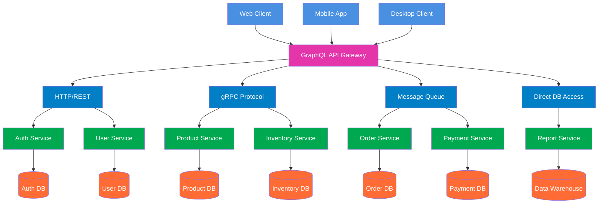

# 1. Jelaskan teorema CAP dan BASE dan keterkaitan keduanya. Jelaskan menggunakan contoh yang pernah anda gunakan. 

Teorema CAP menyatakan bahwa dalam sistem terdistribusi, hanya dua dari tiga properti ini yang bisa dipenuhi sekaligus:

* Consistency - Semua node menampilkan data yang sama
* Availability - Setiap request selalu mendapat respons
* Partition Tolerance - Sistem tetap berjalan meski ada gangguan jaringan

Dalam praktiknya, Partition Tolerance hampir selalu wajib, sehingga pilihan nyata adalah:

* CP - Konsistensi diutamakan, tapi mungkin tidak available saat gangguan
* AP - Ketersediaan diutamakan, tapi data mungkin tidak konsisten sementara

BASE adalah filosofi untuk sistem yang memilih AP:

* Basically Available - Sistem tetap merespons meski dengan keterbatasan
* Soft State - Data bisa berubah tanpa input baru
* Eventually Consistent - Data akan konsisten setelah beberapa waktu

Hubungannya:

* CAP = Kerangka teori yang menjelaskan trade-off
* BASE = Implementasi praktis untuk sistem yang memilih AP

Contoh Penerapan:

Manajemen Stok (CP): Layanan ini bertanggung jawab atas jumlah stok produk. Ketika partisi terdeteksi, layanan akan menolak permintaan "kurangi stok" atau "tambah stok" (menjadi tidak tersedia atau tidak merespons dengan cepat) daripada mengambil risiko konsistensi data. Kami tidak ingin dua pelanggan membeli produk yang sama dan keduanya berhasil karena data stok tidak konsisten. Setelah jaringan pulih, operasi dilanjutkan dan konsistensi terjaga.

Keranjang Belanja (AP): Layanan ini menangani keranjang belanja pengguna. Jika terjadi partisi, layanan tetap tersedia dan membiarkan pengguna menambah atau menghapus item dari keranjang mereka. Data keranjang sementara disimpan secara lokal di node yang terpisah. Akibatnya, untuk sementara waktu, jika pengguna mengakses dari perangkat yang berbeda (yang mungkin terhubung ke node yang berbeda), mereka mungkin melihat keranjang yang sedikit tidak sinkron. Namun, setelah partisi jaringan teratasi, sistem akan menyinkronkan semua perubahan.

# 2. Jelaskan keterkaitan antara GraphQL dengan komunikasi antar proses pada sistem terdistribusi. Buat diagramnya. 

GraphQL berfungsi sebagai lapisan abstraksi yang menyederhanakan komunikasi antar proses (IPC) dalam sistem terdistribusi. Daripada client harus berkomunikasi langsung dengan berbagai microservices menggunakan berbagai protokol IPC, GraphQL menyediakan satu endpoint terpadu yang menerjemahkan query client menjadi serangkaian pemanggilan IPC terkoordinasi ke berbagai service backend.

GraphQL resolver bertindak sebagai orchestrator yang mengelola kompleksitas IPC - menentukan service mana yang perlu dipanggil, menggunakan protokol apa (REST, gRPC, dll), dan mengaggregasi hasilnya. Client cukup mengirimkan query tunggal yang mendefinisikan kebutuhan data, sementara GraphQL yang menangani multiple IPC calls ke berbagai services.

Keuntungan utamanya adalah efisiensi dan simplikasi. Client terhindar dari over-fetching dan under-fetching data, serta tidak perlu memahami kompleksitas arsitektur microservices di backend. Di sisi lain, tim backend dapat mengembangkan services secara independen selama GraphQL schema tetap konsisten, menciptakan sistem terdistribusi yang lebih maintainable dan scalable.

## Diagram Arsitektur GraphQL sebagai API Gateway

